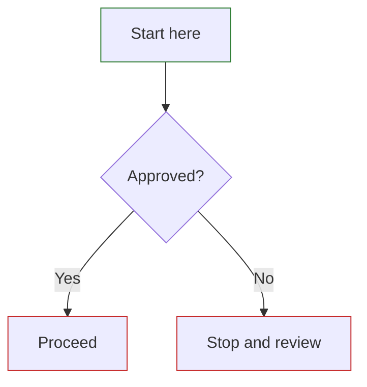

<!--
SECTION PURPOSE: Introduce repository-specific Markdown guidance.
PROMPTING: Keep instructions concrete and tied to the Astro + GOV.UK pipeline used in this repo.
COMPLIANCE: Treat the rules below as the default for all authored Markdown content.
-->

# Markdown Instructions

<CRITICAL_REQUIREMENT type="MANDATORY">

- Write content in standard Markdown by default: headings, paragraphs, lists, tables, blockquotes, and fenced code blocks are all supported.
- Prefer Markdown over raw HTML whenever Markdown can express the content clearly.
- When raw HTML is required anywhere in a Markdown file, add the appropriate GOV.UK classes manually because automatic GOV.UK class decoration only applies to Markdown-generated HTML.
- Use Mermaid diagrams instead of ASCII flow diagrams for process, journey, and decision flows.
- Follow the internal link rules exactly: internal page links must be relative, must end with a trailing `/`, and must omit the source `.md` extension.

</CRITICAL_REQUIREMENT>

<!--
SECTION PURPOSE: Explain the Markdown features the site supports out of the box.
PROMPTING: Reinforce Markdown-first authoring so page content stays readable in source.
-->

## General Markdown Authoring

1. Use one top-level `#` page heading in the body content unless the page intentionally omits it.
2. Use tables only for genuinely tabular content; use lists or sections for prose.
3. Keep fenced code blocks for commands, code samples, or literal snippets.
4. Do not use ASCII art diagrams for flows; convert them to Mermaid.

<!--
SECTION PURPOSE: Document the custom Markdown transformations implemented in govukMarkdown.js.
PROMPTING: Give exact authoring patterns so contributors can use the custom features without reading the plugin source.
-->

## Custom Markdown Features

Markdown content in this repository is processed through `govukMarkdown.js`, which adds GOV.UK styling and a small set of custom authoring patterns.

### Automatic GOV.UK Styling

The Markdown pipeline automatically adds GOV.UK classes to common Markdown-generated elements, including:

- headings
- paragraphs
- links
- ordered and unordered lists
- tables and captions
- horizontal rules

Markdown tables are also adapted for accessibility so the first body column is rendered as a row header.

### Button Links

To render a Markdown link as a GOV.UK button, prefix the link text with `button!`.

Example:

```md
[button!Start now](./next-step/)
```

This renders as a GOV.UK button and the `button!` prefix is removed from the visible label.

### Details Shorthand

To render a GOV.UK details component without embedding raw HTML, use a one-column Markdown table with:

- a single header cell containing `[details]`
- exactly two body rows
- row 1 as the summary text
- row 2 as the details body text

Example:

```md
| [details]                                                        |
| ---------------------------------------------------------------- |
| How do I request access?                                         |
| Follow [Process P-010](../p-010-access-to-sandbox-environment/). |
```

This is transformed into a GOV.UK details component and should ALWAYS be used instead of hand-writing a details block in raw HTML.

### ASCII Fences

ASCII code fences are supported, but they are treated as GOV.UK inset text rather than diagram syntax.

Use ASCII fences only for literal text examples. Do not use them for flow diagrams.

<!--
SECTION PURPOSE: Standardise Mermaid usage so diagrams match the site's existing style and central theme configuration.
PROMPTING: Capture both the global theme behavior and the local diagram conventions already used in process pages.
-->

## Mermaid Diagrams

Mermaid is supported site-wide and already configured through Astro with a shared GOV.UK-aligned theme. Do not redefine the theme per diagram unless there is a strong, explicit requirement.

### When to Use Mermaid

- Use Mermaid for process flows, decision trees, and step-by-step journeys.
- Prefer Mermaid instead of ASCII art or pseudo-diagram formatting.

### House Style

Follow the style already used in the process pages:

1. Use fenced Mermaid blocks: ` ```mermaid `.
2. Prefer `flowchart TD` for vertical process and decision flows.
3. Use quoted labels inside square brackets for process nodes, for example `Start["Ready to begin?"]`.
4. Use curly braces for decision nodes, for example `Decision{"Approved?"}`.
5. Group node declarations first, then edges, then `classDef` and `class` statements.
6. Keep the GOV.UK-aligned emphasis classes used in existing diagrams:



### Mermaid Links and Embedded HTML

- If a Mermaid node label must include a link, use an HTML anchor with the GOV.UK link class, for example `<a class='govuk-link' href='../other-page/'>Related page</a>`.
- This Mermaid-specific guidance does not replace the broader rule: any embedded HTML anywhere in Markdown files must include the appropriate GOV.UK classes.
- Apply the same internal link rules inside Mermaid labels as you do in normal Markdown.

<!--
SECTION PURPOSE: Tell authors how to embed HTML safely when Markdown alone is insufficient.
PROMPTING: Emphasize GOV.UK class usage because raw HTML bypasses the automatic Markdown styling pipeline.
-->

## Embedded HTML

Use raw HTML only when Markdown cannot represent the required structure or behavior.

When embedding HTML anywhere in a Markdown file:

1. Add GOV.UK classes manually where appropriate.
2. Use semantic HTML first.
3. Keep the markup minimal and local to the need.

Common examples:

- links: `class="govuk-link"`
- details: `govuk-details`, `govuk-details__summary`, `govuk-details__summary-text`, `govuk-details__text`
- buttons rendered as anchors: `govuk-button`

Prefer the custom Markdown shorthand when available, for example the `[details]` table syntax instead of hand-writing a details block.

<!--
SECTION PURPOSE: Document the repository's relative-link rules driven by Astro output and GitHub Pages deployment.
PROMPTING: Provide explicit examples because these rules are easy to get wrong when authoring Markdown source files.
-->

## Internal Link Rules

This repository is deployed through Astro to GitHub Pages with trailing slashes enabled. Write internal links for the generated site structure, not for raw `.md` files.

### Required Rules

1. Internal page links must be relative.
2. Internal page links must end with a trailing `/`.
3. Internal page links must omit the `.md` extension.
4. Links to sibling pages must start with `../`.
5. The same rules apply in Markdown links, raw HTML `href` values, and Mermaid node labels.

### Examples

Correct sibling-page link:

```md
[Next process](../p-002-obfuscate-pii-and-revalidate/)
```

Correct child-page link from an index page:

```md
[Process P-001](./p-001-scan-code-for-pii/)
```

Incorrect forms:

```md
[Wrong](./p-002-obfuscate-pii-and-revalidate.md)
[Wrong](./p-002-obfuscate-pii-and-revalidate)
[Wrong](./p-002-obfuscate-pii-and-revalidate/)
```

The final example above is incorrect for a sibling page because sibling page links must use `../`, not `./`.
