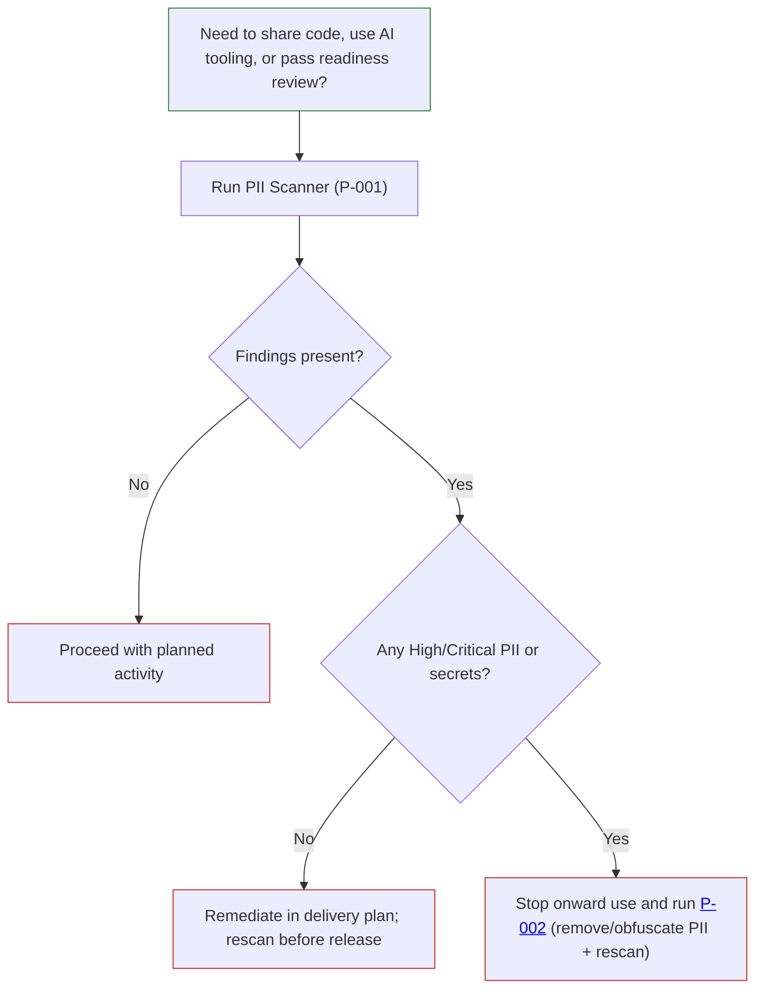

# P-002: How to Check Source Code for PII Before AI Use or Sharing

**Process ID:** P-002

**Title:** How to check source code for personal data (PII) before AI use, sharing, or release

**What You're Trying To Do:**
Confirm whether source code contains personal data or secrets before it is shared with other teams, used in AI tooling, or moved into environments where wider access exists.

**Who This Is For:**
Project managers, delivery leads, engineers, architects, security reviewers, and governance staff who need a clear yes/no decision on whether code is safe to proceed.

**Step-by-Step:**

1. Identify the code set to be checked (for example, one application repository or one release branch).
2. Decide why the check is needed now. Common triggers are:
   - code is about to be shared outside the current team
   - code is about to be used with AI-assisted tools
   - code is approaching release or service-readiness review
3. Run a scan using the scanner tool and generate a report format suitable for your audience:
   - HTML for stakeholder review
   - Markdown for documentation packs
   - JSON for pipeline and audit storage
4. Review the findings summary by severity (Critical, High, Medium, Low) and by category (PII, passwords, API keys, tokens).
5. Decide one of three outcomes:
   - **No findings:** proceed to the next process or delivery stage.
   - **Low-risk findings only:** fix in normal sprint flow and rescan before release.
   - **Any high-risk findings (PII/secrets):** stop sharing/AI use and move immediately to P-002 (obfuscate PII/remove and recheck).
6. Record the decision and report location in project governance notes.

**Decision Tree / Flow Diagram:**

**Who To Contact:**
Delivery lead (scope and timing), security approver (risk acceptance), and data protection/governance contact (compliance decision).

**Governance / Approval Gate:**
Code must not be used with AI tools or shared beyond the approved boundary until P-001 has been completed and reviewed. Any High/Critical personal data findings require security and governance review before proceeding.

**Related Blocker:**
Blocker 2 - PII in Source Code

**Related Agent/Tool Links:**

- [LAP PII Screener repository](https://github.com/DEFRA/lap-pii-screener)
- [Obfuscation workflow guide](https://github.com/DEFRA/lap-pii-screener/blob/main/docs/guides/obfuscation.md)
- [Scanning guide](https://github.com/DEFRA/lap-pii-screener/blob/main/docs/guides/scanning.md)
- [Reporting guide](https://github.com/DEFRA/lap-pii-screener/blob/main/docs/guides/reports.md)

**Status:**
Draft (recommended for immediate use as a decision gate)
