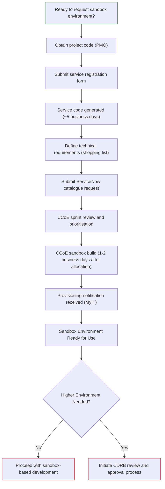

# P-010: How to Request and Provision a Sandbox Environment

**Process ID:** P-010

**Title:** How to request and provision a sandbox environment through the Cloud Centre of Excellence (CCoE)

**What You're Trying To Do:**
Request and provision a non-production Azure sandbox environment to support development, testing, and AI-assisted modernisation activities for your LAP project through the CCoE's standardised provisioning process.

**Who This Is For:**
Project managers, technical leads, delivery leads, finance/cost centre owners, and cloud operations teams responsible for requesting and provisioning sandbox environments through CCoE.

**Scope:**
Applies to any LAP application requiring a non-production sandbox Azure environment provisioned through CCoE. Progression to higher environments (development, test, pre-production, production) requires Cloud Design Review Board (CDRB) approval and follows the standard CDRB governance process.

**Step-by-Step:**

**Step 1** – Obtain valid Project Code\
**Owner:** PMO.\
Before requesting a sandbox environment, ensure you have the correct project code from LAP PMO (for example, **DEFCOOD3P652**) to ensure CCoE consumption costs in Azure (and AWS) are correctly recharged to your project.

**Step 2** — Complete the Service Registration Form _(See Template 1)_
**Owner:** Project Manager.\
This includes project details, service owner, cost centre and project code.
This Service Registration Form generates the Service Code.

**Step 3** — The Service Code is generated\
**Owner:** CCoE FinOps Finance Team . ~5 working day lead time.\
Produces a 3-letter Service Code. This is then required in step 5.

**Step 4** — Complete the Shopping List _(See Template 2)_\
**Owner:** Technical Lead\
The technical definition of the environment: containers, key vault, storage, database, networking, AI components, monitoring.

**Step 5** — Raise MyIT (ServiceNow) Catalogue Request (_See Template 3_)\
**Owner:** Project Manager\
Include the Service Code and attach the Shopping List (_See Template 2_) to the request. Also provide a descriptive Service Name, which will be applied as the ServiceNameTag to deployed resources for identification and management purposes.
Format:
Service Name: <Brief name or description of the environment>
Example:
Service Name: LAP RPA Tenancy Upgrade (Atos/Microsoft)

**Step 6** – Sprint Review with Engineering Prioritisation\
**Owner:** Cloud Centre of Excellence (CCoE)\
Lead time: Fortnightly sprint cadence\
Submit the request to the CCoE for inclusion in the next sprint review. The CCoE engineering team will review and prioritise in the next sprint cycle.

**Step 7** — Sprint Allocation\
**Owner:** Cloud Centre of Excellence (CCoE)\
Approved → Queued → Allocated to Sprint → Built.

**Step 8** — Sandbox Provisioned\
The requestor is automatically notified through **MyIT (ServiceNow)** when the sandbox environment has been provisioned and is ready for use. The notification will reference the associated request number and the name of the subscription created, for example AZD-ACD-SND. and the Azure DevOps repository used to deploy the project.

CDRB Review (Higher Environments Only)\
For environments beyond the Sandbox (for example, Development, Test, Pre-Production, or Production), a Cloud Design Review Board (CDRB) review and approval is required. This ensures the proposed solution meets architecture, security, governance, and operational standards before provisioning can proceed. CDRB sessions are held every Wednesday morning. Please refer to the CCoE Engagement Guide for details on the review process and how to schedule a CDRB.

**Flow Diagram:**

**Who To Contact:**

- **Project Code/Finance:** PMO (finance administration)
- **Service Registration:** Project Manager / CCoE FinOps Finance Team
- **Technical Requirements:** Technical Lead (in consultation with CCoE)
- **ServiceNow Request Submission:** Project Manager
- **Sprint Review & Allocation:** CCoE Engineering Team
- **Request Tracking & Status:** MyIT (ServiceNow) ticket system
- **CDRB Review (Higher Environments):** Cloud Design Review Board

**Governance / Approval Gate:**

- **Service Code:** CCoE FinOps Finance Team approval (required before step 5)
- **Shopping List Review:** CCoE Engineering Team approval during sprint review
- **Sandbox Provisioning:** CCoE Engineering Team approval and build (automated notification upon completion)
- **Higher Environments:** Requires formal CDRB review and approval before any provisioning beyond sandbox tier

---

## Supporting Resources

### RACI Matrix

| Activity  | Owner  | RACI  |
| --- | --- | --- |
| Obtain Project Code  | PMO  | R/A  |
| Completion of Registration Form  | Project Manager/ PMO/ PSO  | R/A  |
| Service Code generation  | CCoE Finance FinOps  | R/A  |
| Shopping List  | Tech Lead  | R/A  |
| Raising Request in Service Now (incl. Shopping List)  | PM  | R/A  |
| Creation of Sandbox Subscription  | CCoE Engineering  | R/A  |
| Deployment of Subscription  | User that has access to the subscription  | R/A  |

### Lead Time Tracker

| Step  | Typical Duration  | Status  |
| --- | --- | --- |
| Service Code  | ~5 business days  | Confirmed  |
| Sprint Allocation  | 2 weeks  | Confirmed  |
| Build  | 1-2 business days  | Confirmed  |

Tracking table (to be populated as real requests go through the process):
| Application  | Project Code obtained  | Service Registration Form completed  | Service Code issued  | Shopping List completed  | ServiceNow Request reference  | Sprint Review planned  | Sprint allocated  | Sandbox provisioned  |
| --- | --- | --- | --- | --- | --- | --- | --- | --- |
| Example: CORE DEFRA LAP MS Accelerated AI Delivery  | DEFCOOD301354  | Yes  | ACD  | Yes  | RITM1424918  |   | Yes  | AZD-ACD-SND1  |

### Template 1 — Service Registration Form (Step 2)

Application / Project Name:\
Project’s Delivery Manager:\
Cloud Service Provider:\
Official Name of the Business Service being delivered:
Is this a line of business service or a CCOE shared foundational service:\
Description of the cloud business service or application:\
Which Defra Group organisation will be the owner:\
Which Defra Group organisation is funding the project:\
The amount the budget holder has agreed is available to fund the cloud related costs this service is expected to incur this financial year:\
SOP Project Code that CCoE should use to recharge cloud consumption costs to:\
SOP Task Code to be used when recharging to the SOP Project Code:\
Responsible owner for managing the costs incurred by this Service:

_For access to this template, please follow this link:_ [_New Cloud Business Service/Application Registration_](https://defra.sharepoint.com/sites/def-ddts-cloud/_layouts/15/listforms.aspx?cid=YTdmMzhhMTEtMDYzMi00ZjhlLWE5NjktMzI4NDRlOTRlODlk&nav=MTZhNDM5MjgtNmNkZC00ZDk3LTgzNmQtYjc0ZGNhOWE1OWUy&xsdata=MDV8MDJ8fDdiZjNkZDgwY2QxNzQyNGVmODM2MDhkZWUyNmZjZTRlfDc3MGEyNDUwMDIyNzRjNjI5MGM3NGUzODUzN2YxMTAyfDB8MHw2MzkxOTcxNjY5NjM3MTgxOTh8VW5rbm93bnxWR1ZoYlhOVFpXTjFjbWwwZVZObGNuWnBZMlY4ZXlKRFFTSTZJbFJsWVcxelgwRlVVRk5sY25acFkyVmZVMUJQVEU5R0lpd2lWaUk2SWpBdU1DNHdNREF3SWl3aVVDSTZJbGRwYmpNeUlpd2lRVTRpT2lKUGRHaGxjaUlzSWxkVUlqb3hNWDA9fDF8TDJOb1lYUnpMekU1T20xbFpYUnBibWRmVG5wT2FVMHlSWGhhVkUxMFRWZFZlVnBUTURCYVZGbDNURlJuTkU1cVZYUlpha3BvVGxkU2FscFVSVE5OVkVadFFIUm9jbVZoWkM1Mk1pOXRaWE56WVdkbGN5OHhOemcwTVRFNU9EazFNVGM0fDA4N2Q5OTc2MDU5YjQyMTBmODM2MDhkZWUyNmZjZTRlfGYzNGNmNmRkZmM5ZDRkYWE4Njg1NjYyODA0YzIzZjBi&sdata=YXdpTzhDaGw2WkVqWUlSSWg0dU50bXdiZnBUQmw4Rk0yMkpGNDdvZTBFbz0%3D&ovuser=76a2ae5a-9f00-4f6b-95ed-5d33d77c4d61%2Comar.adili%40capgemini.com)

### Template 2 — Shopping List (Step 4)

| **Component**  | **Required?**  | **Notes**  |
| --- | --- | --- |
| Application / Project Name:  | Yes  |    |
| Service Code:  | Yes  |    |
| Subscription/resource group (network space requirement)  | Require a CIDR  of any range that is documented/evidenced  |    |
| GitHub Copilot access and licensing  | Yes  | LAP Projects to request  |
| Container registry if using containers  | If it’s a Dev subscription, then there’s a requirement from Azure to create 1 Azure container registry. If it’s a non Dev subscription, then it’s CCoE responsibility to create 1 Azure container registry  | If it’s a Dev subscription, then there’s a requirement from Azure to create with contributor rights. If it’s a non Dev subscription, then it’s CCoE responsibility to create the contributor rights.|
| Network integration if private access is needed  | No peering initially, address space would need to be assigned from the spreadsheet to avoid a clash if requested at a later date  | Need to connect AVD to access. Service endpoints or IP whitelisting on sandbox resources may be required. Unrestricted public access should not be permitted on sandbox resources wherever it can be avoided.    |
| Key Vault for secrets/config.  | Yes  | LAP Projects can deploy  |
| Storage account if the app needs files etc  | Yes  | LAP Projects can create own account & containers. Can use service endpoints to restrict.  |
| App Service or Azure Container Apps depending on how the refactored app runs  | Yes. 1x sandbox environment   ACA & App Service isolated   General purpose workload for ACA  | Request onboarding to the supplier CCoE RAS service or whitelist the supplier service   Need to know if the supplier will use their own RAS service as need to whitelist    |
| Any integration points e.g. developer workstations to Azure, VPN access  | Need permission to create private endpoints and approve   AVD required  |    |
| Databases requirements?  | Need permission to create database services  | LAP projects to create    |
| App Config manager linked to Key Vault?  | Yes  |    |
| App Regs etc.?  | Requested from CCoE  | Defra Dev  has MyIT so LAP projects can request DefraDev App Reg: [https://defragroup.service-now.com/esc?id=sc_cat_item&table=sc_cat_item&sys_id=496b9d931b2cce90848b8594e34bcbe5&searchTerm=application%20registration](https://defragroup.service-now.com/esc?id=sc_cat_item&table=sc_cat_item&sys_id=496b9d931b2cce90848b8594e34bcbe5&searchTerm=application%20registration)  |
| DefraDev tenant  | Yes – specificity DefraDev Tenant is required  | When a request is made, CCoE should be made aware that the project specifies the DefraDev tenant  |

_For access to this template, please follow this link:_ [_CCoE AI Modernisation Sandbox Shopping List – Standard Requirements_](https://defra.sharepoint.com/:x:/r/teams/Team1382/Colab_P2/02%20Capgemini%20Collaboration/AI%20Enablement/CCoE%20AI%20Modernisation%20Sandbox%20Shopping%20List%20-%20Standard%20Requirements.xlsx?d=w6dcab77a588542a0967063d75b76bbb9&csf=1&web=1)

### Template 3 — ServiceNow Request (Step 5)

| **Requested By:**  |    |
| --- | --- |
| **Cloud Platform:**  |    |
| **Issue Type:**  |    |
| **Project:**  |    |
| **Environment:**  |    |
| **Full Description:**  |    |

_For access to this template, please follow this link:_ [_CCOE Azure/AWS Non-Production Service Request - MyPortal_](https://defragroup.service-now.com/esc?id=sc_cat_item&table=sc_cat_item&sys_id=cedac95b1b224510adf0eb53b24bcb63&recordUrl=com.glideapp.servicecatalog_cat_item_view.do%3Fv%3D1&sysparm_id=cedac95b1b224510adf0eb53b24bcb63)

---
