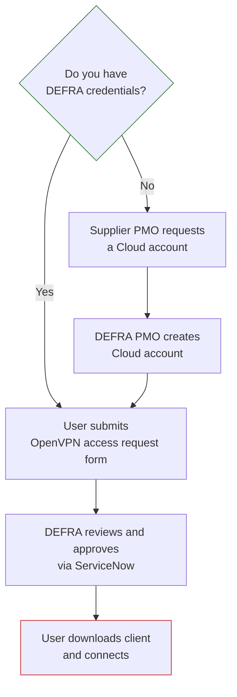

# Open VPN Access

Request OpenVPN access to give approved supplier personnel a secure, encrypted connection from their own devices into DEFRA networks. Prepare the required credentials and access group information, then follow the request and connection steps below.

## What you're trying to do

Create a repeatable OpenVPN onboarding process for each resource so that any future LAP Delivery Team can follow it without relying on DEFRA staff to walk through it personally.

## Who this is for

Primary audience:

- a supplier, project manager, delivery manager, or technical lead supporting DEFRA services
- a supplier user requesting OpenVPN access for the first time
- a project lead coordinating onboarding of multiple supplier users

## What OpenVPN is

OpenVPN is open-source virtual private network (VPN) software used by DEFRA to enable secure connections from supplier laptops to DEFRA systems. It is used mainly by software engineering projects and support teams.

It gives approved supplier personnel a secure, encrypted connection into DEFRA networks from their own devices, so they can reach the DEFRA systems they need for delivery work.

## How OpenVPN differs from AVD

OpenVPN and [Azure Virtual Desktop (AVD)](../azure-virtual-desktop-access/) are both ways for suppliers to reach DEFRA systems securely, but they work differently, solve different problems, and are requested separately. Confirm which one you need before submitting a request.

- **OpenVPN** gives you a secure route in from your own device. You continue working on your own laptop, using the tools already installed on it. OpenVPN provides the encrypted network connection that lets your device reach DEFRA systems.
- **AVD** gives you a DEFRA-controlled desktop to work inside. Instead of connecting your own device to DEFRA's network, you sign in to a virtual desktop hosted in Microsoft Azure and managed by DEFRA. The work happens there, on DEFRA's infrastructure, using only the tools that have been requested and provisioned for that desktop.

DEFRA offers both because they manage different risks. OpenVPN is about giving a trusted device a secure route in. AVD is about keeping the work itself inside a DEFRA-controlled environment, which reduces the risks that come with unmanaged devices.

|                                         | **OpenVPN**                                                                 | **Azure Virtual Desktop (AVD)**                                                                            |
| --------------------------------------- | --------------------------------------------------------------------------- | ---------------------------------------------------------------------------------------------------------- |
| What you get                            | A secure, encrypted connection from your own device into DEFRA networks     | A DEFRA-managed virtual desktop, hosted in Microsoft Azure, that you sign in to                            |
| Where the work happens                  | On your own laptop                                                          | On the DEFRA-controlled desktop                                                                            |
| Tools you use                           | Whatever is already installed on your own device                            | Only the tools requested and provisioned for that desktop — standard tooling is not provided automatically |
| Main purpose                            | Reaching DEFRA systems and networks from your own device                    | Keeping work inside a DEFRA-controlled environment and reducing the risks of unmanaged devices             |
| What you need first                     | To be onboarded to the DEFRA account, with valid DEFRA credentials          | A named DEFRA sponsor such as a service owner, project manager, or authorised representative               |
| How to request                          | The Microsoft form linked on this page, approved via ServiceNow             | A supplier access request form, provisioned by the DEFRA DevOps Engineering Team                           |
| Your organisation's own security policy | VPN software is often blocked by default and may need an internal exemption | AVD does not require VPN software to be installed on your device                                           |

Depending on your role and what you need to reach, you may need one or both. If you're not sure which applies to your work, check with your project or technical lead before requesting either.

## When you need OpenVPN

Request OpenVPN access when supplier personnel need to connect securely to:

- DEFRA networks and systems
- DEFRA-hosted applications
- development and support environments
- other DEFRA services required for delivery work

## Before you start

Make sure the following are in place before you request OpenVPN access.

1. **Be fully onboarded to the DEFRA account.** Contact your own organisation's onboarding or business services team to complete onboarding. This confirms you meet DEFRA's security standards and that you're included in the access arrangements for the DEFRA account.

2. **Have valid DEFRA credentials.** You need one of the following:
   - a `defra.gov.uk` account, obtained through a DEFRA laptop, or
   - a `defra.onmicrosoft.com` account, obtained by gaining a DEFRA Cloud account.

   If you don't already have either, a Cloud account is requested through your supplier PMO — see "How to request access" below.

3. **Know which access group you need.** You'll need to state which OpenVPN access group the user requires. Examples include:
   - `AG-APP-Defra-Azure-OpenVPN-RSP-X-Cutting`
   - `AG-APP-Defra-Azure-OpenVPN-ADP-Users`
   - `AG-APP-Defra-Azure-OpenVPN-EPR`

   If you're not sure which group applies, check with your project or technical lead before submitting the request.

4. **Be able to set up multi-factor authentication (MFA).** You'll be prompted to configure MFA the first time you sign in, if you haven't already done so.

5. **Check that your own organisation permits OpenVPN.** Many suppliers block VPN software by default under their own cybersecurity policies. If that applies to your organisation, you'll need an exemption from your own IT team before the software can be installed and used on your device. Arrange this early — it is a common cause of delay.

## Security clearance

Security Clearance (SC) is not required for OpenVPN access. You do not need confirmed SC clearance, or an SC waiver, to request or use OpenVPN.

## How to request access

The request follows five steps. Some are handled for you; the table shows who is responsible for each.

| Step | Description                                                                | Who is responsible        |
| ---- | -------------------------------------------------------------------------- | ------------------------- |
| 1    | Request a Cloud account (only if you don't already have DEFRA credentials) | Supplier PMO              |
| 2    | Cloud account created                                                      | DEFRA PMO                 |
| 3    | Request OpenVPN access using the portal linked below                       | The user requiring access |
| 4    | Request reviewed and approved                                              | DEFRA, via ServiceNow     |
| 5    | Follow the instructions to download and connect                            | The user requiring access |

To submit your request, complete the information requested on the [OpenVPN access portal](https://defragroup.service-now.com/esc?id=kb_article&table=kb_knowledge&sys_id=ce3cafdb83627d10eb2fa940ceaad384).

Once you've submitted the form, you should receive:

- an email confirming that your request has been approved, and
- an email with instructions on how to download the latest OpenVPN client software to your device

## Connecting for the first time

Once your request has been approved, follow these steps to download the client software and connect.

1. Browse to the [DEFRA OpenVPN portal](https://openvpn.azure.defra.cloud).
2. At the authentication prompt, select **Sign In via SAML**.
3. Enter your usual credentials for connecting to OpenVPN with your DEFRA account and password.
4. If you haven't set up multi-factor authentication (MFA) before, you'll be prompted to configure it for the account now.
5. Once authenticated, download the latest VPN client software to your device.
6. Under **Available Connection Profiles**, select **Yourself (user-locked profile)**.
7. Open the downloaded profile and choose **OK** to import it into OpenVPN Connect.
8. In the OpenVPN Connect client, toggle the **Connect** button next to your profile.

If you have trouble downloading the software, contact your own organisation's IT service desk. See "If something goes wrong" below.

## How to check whether you already have OpenVPN

If you're not sure whether OpenVPN is already installed and working on your device:

1. Search your device for the **OpenVPN Connect** app.
2. Open the OpenVPN Connect app.
3. Select the toggle to connect. You'll be prompted to sign in.
4. Sign in using the account you normally use for DEFRA access.
5. Once you've signed in successfully, OpenVPN should connect.

## If something goes wrong

Work through the following, in order:

- **Confirm you're fully onboarded to the DEFRA account.** Access problems are often caused by incomplete onboarding. Check with your organisation's onboarding or business services team.
- **Check whether your own organisation is blocking the software.** VPN software is blocked by default under many suppliers' cybersecurity policies. If so, your own IT team will need to apply an exemption before you can install or run it.
- **For problems downloading or installing the client**, contact your own organisation's IT service desk.
- **For problems signing in, with MFA, or with the access group you've been given**, raise the issue with DEFRA through ServiceNow.
- **If the problem continues**, raise a ticket with your own IT team so it can be escalated.
