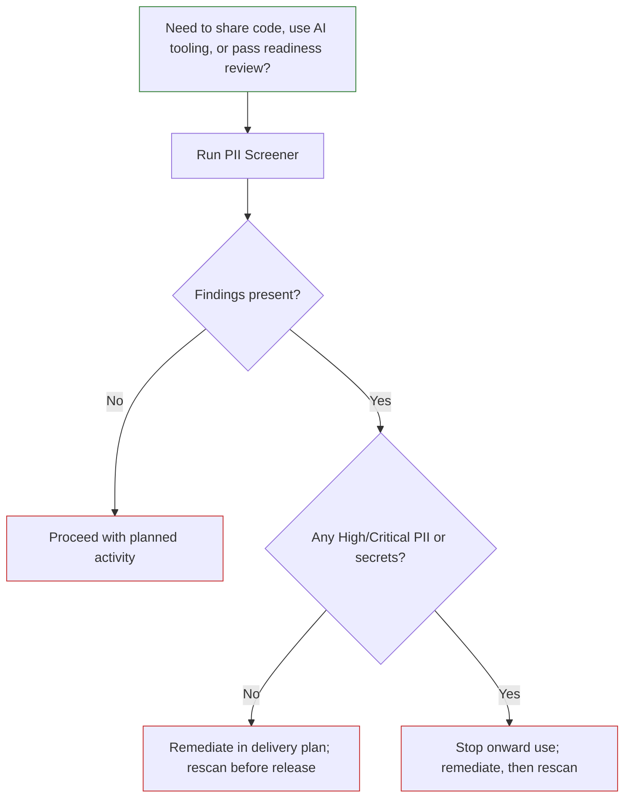

# PII Screener tool

The [LAP PII Screener](https://github.com/DEFRA/lap-pii-screener) is a multi-scanner static analysis tool that finds secrets, API keys, and personally identifiable information (PII) in source code repositories. It combines four scanners into a single CLI, deduplicates their results, maps every finding to remediation guidance and applicable regulation, and can optionally replace sensitive values directly in source files.

The tool is intended to be run before source code is shared outside the current team, used with AI-assisted tooling, or moved into environments with wider access.

## What problem does it solve?

Organisations routinely store sensitive data in the wrong places — configuration files, test fixtures, comments, migration scripts, and seed data. This creates two categories of risk:

- **Secrets exposure** — API keys, passwords, and tokens that grant access to systems. Once committed to source control they are permanently in Git history even after deletion.
- **PII in code** — Real email addresses, phone numbers, names, and financial data committed as test data or hardcoded values. This creates GDPR Article 5 compliance obligations and potential Article 83 penalties.

## What it finds

| Category                  | Examples                                                                                                                                    |
| ------------------------- | ------------------------------------------------------------------------------------------------------------------------------------------- |
| API keys and tokens       | AWS, Azure, GitHub, Stripe, Slack, JWT tokens                                                                                               |
| Passwords and credentials | Hardcoded passwords, database connection strings, private keys                                                                              |
| Structured PII            | Email addresses, phone numbers, credit card numbers, NI numbers, NHS numbers, passports, dates of birth, SSNs, IBANs, sort codes, postcodes |
| Unstructured PII          | Person names and addresses in comments or string literals (requires spaCy)                                                                  |
| Security vulnerabilities  | SQL injection, XSS, broken authentication, and OWASP Top 10 patterns (via Semgrep and SonarQube)                                            |

Every finding is enriched with a confidence score, the applicable regulation (UK GDPR, PCI DSS, PSR 2017), step-by-step remediation instructions, and cross-references to CWE and OWASP identifiers.

## How it works

The CLI requests all four scanners by default and skips scanners that are not available. Their results are merged, duplicate findings are deduplicated, and findings detected by multiple scanners include all the scanner names and receive a confidence boost.

| Scanner         | What it contributes                                                                                   |
| --------------- | ----------------------------------------------------------------------------------------------------- |
| **Gitleaks**    | Secret pattern matching — fast, purpose-built, 150+ service-specific rules                            |
| **Semgrep**     | Code-structure-aware analysis — catches patterns that span multiple tokens                            |
| **PII scanner** | Custom PII detection — built-in structured regex, with optional Presidio NER preferred over spaCy NER |
| **SonarQube**   | Enterprise deep analysis — data-flow tracking, taint propagation, inter-procedural reasoning          |

Gitleaks, Semgrep, and the custom PII scanner form the baseline. The PII scanner's structured regex rules run without either NLP package. Presidio adds preferred named-entity detection for person names and locations in comments or string values; spaCy provides the fallback when Presidio is unavailable. SonarQube adds deeper inter-procedural and taint analysis and requires Java 17 with a local SonarQube instance, or a container runtime. The active scanner tier is shown by `sensitive-scanner status`.

## Prerequisites

| Requirement     | Version | Notes                                                  |
| --------------- | ------- | ------------------------------------------------------ |
| Python          | 3.11+   | Must be on PATH                                        |
| uv              | Latest  | Package manager — `pip install uv`                     |
| Java            | 17+     | Only needed for SonarQube                              |
| Git             | Any     | Needed only when scanning Git commit history           |
| Docker Desktop  | Any     | Alternative to local Python or Java, and for SonarQube |
| Internet access | —       | Required on first run to download binaries             |

The `sensitive-scanner setup` wizard downloads the Gitleaks binary and installs the required scanner dependencies. Use `sensitive-scanner setup --all` to install the optional spaCy and SonarQube components as well.

### Docker (alternative)

Docker lets you run the scanner without installing Python or Java locally. Clone the repository first, then run the script for your shell, passing the source directory to scan:

```powershell
./scripts/init-docker.ps1 -SourceDir C:\path\to\your-project
```

Inside the container, use `./scripts/init-full` for all optional components or `./scripts/init-slim` for the baseline, then run `./scripts/screener scan /source`. Docker Desktop, Docker via WSL, and Docker Engine on Linux are supported.

## Is this the right tool?

Use the PII Screener if you need to:

- confirm source code is safe to share with other teams or use with AI tooling
- produce an auditable report of sensitive data findings before a release or readiness review
- interactively review and obfuscate sensitive values in files while preserving working software

It is a static analysis tool for source code repositories. It does not scan databases or running services, and binary file types are excluded automatically. The scanner can include Git history when `--history` is specified.

## Getting started

Full documentation is maintained in the [GitHub repository](https://github.com/DEFRA/lap-pii-screener).

| Document                                                                                            | What it covers                                                                |
| --------------------------------------------------------------------------------------------------- | ----------------------------------------------------------------------------- |
| [Quick Start](https://github.com/DEFRA/lap-pii-screener/blob/main/docs/setup/QUICKSTART.md)         | Install the tool, run the setup wizard, scan a project, and check its status  |
| [Setup Guide](https://github.com/DEFRA/lap-pii-screener/blob/main/docs/setup/setup.md)              | Full installation, SonarQube, spaCy, Docker, MCP, and air-gapped environments |
| [Docker Setup](https://github.com/DEFRA/lap-pii-screener/blob/main/docs/setup/docker.md)            | Run the scanner in a container without local Python or Java installation      |
| [Scanning guide](https://github.com/DEFRA/lap-pii-screener/blob/main/docs/guides/scanning.md)       | Scan options, exclusions, suppressions, reports, and CI integration           |
| [Obfuscation guide](https://github.com/DEFRA/lap-pii-screener/blob/main/docs/guides/obfuscation.md) | Review, redact or replace findings, dry-run, apply, edit, and rollback        |
| [Faker integration](https://github.com/DEFRA/lap-pii-screener/blob/main/FAKER_INTEGRATION.md)       | Optional realistic replacement values during obfuscation                      |
| [Reports guide](https://github.com/DEFRA/lap-pii-screener/blob/main/docs/guides/reports.md)         | Report formats, contents, and recommended uses                                |
| [Copilot agent guide](https://github.com/DEFRA/lap-pii-screener/blob/main/docs/guides/agent.md)     | Use the scanner from VS Code Copilot Chat through MCP                         |

### Basic scan

After installing the repository dependencies, run the setup wizard and scan the directory you want to assess:

```powershell
git clone https://github.com/DEFRA/lap-pii-screener C:\Github\lap-pii-screener
cd C:\Github\lap-pii-screener
pip install uv
uv sync
sensitive-scanner setup
sensitive-scanner scan C:\path\to\your-project
```

The scanner writes console output by default. Save a report with `--format html`, `--format markdown`, or `--format json` and provide `--output`. Use `--history` when the scan must include deleted files and previous Git commits. By default, matched values are redacted; use `--show-secrets` only when strictly necessary because it writes actual sensitive values into the output.

For regular scans, add a `sensitive-scanner.yaml` file to the project root to define scanners, output, exclusions, suppressions, and a `fail_on` severity threshold for CI.

## Use scan results as a delivery decision gate

Apply this decision gate before code is shared, used with AI tooling, or reviewed for release readiness.

1. Identify the exact code scope to assess (for example, a repository or release branch).
2. Run a scan and produce a report format that suits the audience:
   - HTML for stakeholder review
   - Markdown for documentation packs
   - JSON for pipeline/audit storage
3. Review findings by severity and category.
4. Decide one of three outcomes:
   - **No findings**: proceed.
   - **Low-risk findings only**: remediate in delivery flow and rescan before release.
   - **Any high/critical PII or secrets**: stop sharing/AI use, remediate, then rescan.
5. Record the decision and report location in project governance notes.



## After remediation

Complete the following after remediating sensitive findings:

- rerun the scan over the same scope
- confirm that blocking findings are cleared (or explicitly accepted through governance)
- retain remediation evidence and scan reports in a controlled location for audit and review
