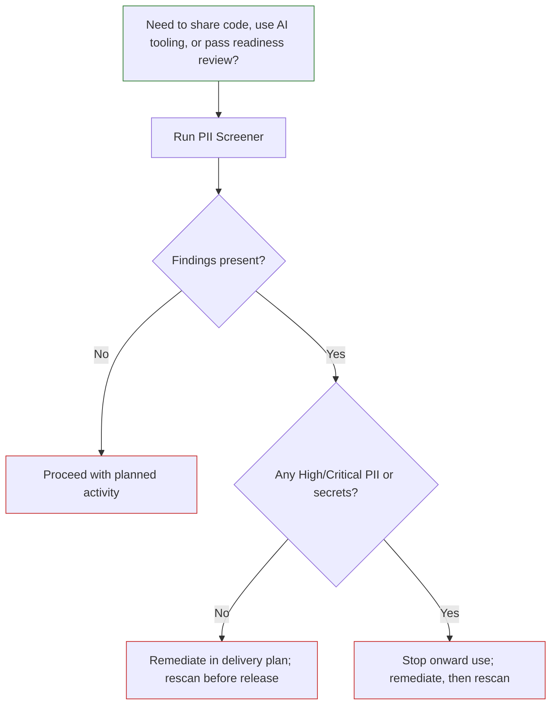

# PII Screener tool

The [LAP PII Screener](https://github.com/DEFRA/lap-pii-screener) is a multi-scanner static analysis tool that finds secrets, API keys, and personally identifiable information (PII) in source code repositories. It combines four independent scanning engines into a single CLI, deduplicates their results, maps every finding to a remediation guide and applicable regulation, and can optionally redact sensitive values directly in source files.

The tool is intended to be run before source code is shared outside the current team, used with AI-assisted tooling, or moved into environments with wider access.

## What problem does it solve?

Organisations routinely store sensitive data in the wrong places — configuration files, test fixtures, comments, migration scripts, and seed data. This creates two categories of risk:

- **Secrets exposure** — API keys, passwords, and tokens that grant access to systems. Once committed to source control they are permanently in Git history even after deletion.
- **PII in code** — Real email addresses, phone numbers, names, and financial data committed as test data or hardcoded values. This creates GDPR Article 5 compliance obligations and potential Article 83 penalties.

## What it finds

| Category                  | Examples                                                                                                                                    |
| ------------------------- | ------------------------------------------------------------------------------------------------------------------------------------------- |
| API keys and tokens       | AWS, Azure, GitHub, Stripe, Slack, JWT tokens                                                                                               |
| Passwords and credentials | Hardcoded passwords, database connection strings, private keys                                                                              |
| Structured PII            | Email addresses, phone numbers, credit card numbers, NI numbers, NHS numbers, passports, dates of birth, SSNs, IBANs, sort codes, postcodes |
| Unstructured PII          | Person names and addresses in comments or string literals (requires spaCy)                                                                  |
| Security vulnerabilities  | SQL injection, XSS, broken auth, OWASP Top 10 (via Semgrep + SonarQube)                                                                     |

Every finding is enriched with a confidence score, the applicable regulation (UK GDPR, PCI DSS, PSR 2017), step-by-step remediation instructions, and cross-references to CWE and OWASP identifiers.

## How it works

Four scanning engines run in parallel against the target directory. Their results are merged and deduplicated.

| Scanner       | What it contributes                                                                          |
| ------------- | -------------------------------------------------------------------------------------------- |
| **Gitleaks**  | Secret pattern matching — fast, purpose-built, 150+ service-specific rules                   |
| **Semgrep**   | Code-structure-aware analysis — catches patterns that span multiple tokens                   |
| **Presidio**  | Custom PII detection — structured regex with optional NLP named-entity recognition           |
| **spaCy**     | NLP named-entity recognition for unstructured PII such as person names and addresses         |
| **SonarQube** | Enterprise deep analysis — data-flow tracking, taint propagation, inter-procedural reasoning |

Gitleaks, Semgrep, and Presidio work without any extra infrastructure and are the default. spaCy is optional and enables unstructured PII detection. SonarQube is optional and requires Java 17 or Docker.

## Prerequisites

| Requirement     | Version | Notes                                      |
| --------------- | ------- | ------------------------------------------ |
| Python          | 3.11+   | Must be on PATH                            |
| uv              | Latest  | Package manager — `pip install uv`         |
| Java            | 17+     | Only needed for SonarQube                  |
| Docker Engine   | Any     | Alternative to native Java for SonarQube   |
| Internet access | —       | Required on first run to download binaries |

### Dev container (alternative)

The tool can also be run inside a dev container, which replaces the Python and uv installation with VS Code and Docker Engine.

| Requirement     | Version | Notes                                       |
| --------------- | ------- | ------------------------------------------- |
| VS Code         | Latest  | With the Dev Containers extension           |
| Docker Engine   | Any     | Must be running before opening in container |
| Internet access | —       | Required on first run to download the image |

## Is this the right tool?

Use the PII Screener if you need to:

- confirm source code is safe to share with other teams or use with AI tooling
- produce an auditable report of sensitive data findings before a release or readiness review
- interactively review and obfuscate PII in files while preserving working software

It is a static analysis tool for source code repositories. It does not scan databases, running services, or binary files.

## Getting started

Full documentation is maintained in the [GitHub repository](https://github.com/DEFRA/lap-pii-screener).

| Document                                                                                            | What it covers                                                      |
| --------------------------------------------------------------------------------------------------- | ------------------------------------------------------------------- |
| [Quick Start](https://github.com/DEFRA/lap-pii-screener/blob/main/QUICKSTART.md)                    | Zero to scanning in 6 steps                                         |
| [Setup Guide](https://github.com/DEFRA/lap-pii-screener/blob/main/docs/setup/setup.md)              | Full installation, SonarQube configuration, air-gapped environments |
| [Scanning guide](https://github.com/DEFRA/lap-pii-screener/blob/main/docs/guides/scanning.md)       | All scan options, exclusions, suppressions, CI integration          |
| [Obfuscation guide](https://github.com/DEFRA/lap-pii-screener/blob/main/docs/guides/obfuscation.md) | Interactive PII review, dry-run, apply, rollback, session files     |
| [Reports guide](https://github.com/DEFRA/lap-pii-screener/blob/main/docs/guides/reports.md)         | Report formats, what each contains, when to use each                |

## Use scan results as a delivery decision gate

Apply this decision gate before code is shared, used with AI tooling, or reviewed for release readiness.

1. Identify the exact code scope to assess (for example, a repository or release branch).
2. Run a scan and produce a report format that suits the audience:
   - HTML for stakeholder review
   - Markdown for documentation packs
   - JSON for pipeline/audit storage
3. Review findings by severity and category.
4. Decide one of three outcomes:
   - **No findings**: proceed.
   - **Low-risk findings only**: remediate in delivery flow and rescan before release.
   - **Any high/critical PII or secrets**: stop sharing/AI use, remediate, then rescan.
5. Record the decision and report location in project governance notes.

## After remediation

Complete the following after remediating sensitive findings:

- rerun the scan over the same scope
- confirm that blocking findings are cleared (or explicitly accepted through governance)
- retain remediation evidence and scan reports in a controlled location for audit and review
