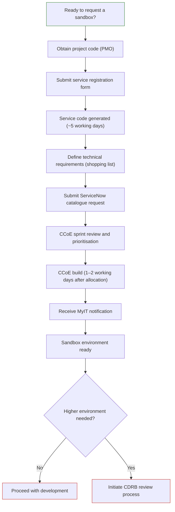

# Sandbox Provisioning

Provisioning a sandbox environment for a LAP project is handled by DEFRA's Cloud Centre of Excellence (CCoE) through a standardised request process. The process involves collecting financial and technical information upfront, submitting a ServiceNow catalogue request, and waiting for CCoE to build and allocate the environment in a sprint cycle.

Sandbox environments are non-production Azure environments intended for development, testing, and AI-assisted modernisation activities. Progression beyond sandbox to higher environments (development, test, pre-production, production) requires a separate Cloud Design Review Board (CDRB) approval.

## Who this is for

Primary audience:

- a project manager or delivery lead coordinating infrastructure for a LAP project
- a technical lead responsible for defining what the environment needs to contain
- a finance or cost centre owner responsible for ensuring costs are recharged correctly

## Before you start

Before raising a request, make sure the following are in place:

- You have a valid project code from LAP PMO (for example, **DEFCOOD3P652**) — costs cannot be recharged without this
- You have access to DEFRA SharePoint and the DEFRA MyIT (ServiceNow) portal
- Your technical lead is available to define the environment's components (the "shopping list")

## The provisioning journey

Sandbox provisioning follows these phases in sequence:

1. **Obtain a project code** from PMO so that Azure consumption costs can be correctly recharged
2. **Submit the Service Registration Form** to register the service and trigger generation of a Service Code
3. **Receive your Service Code** from the CCoE FinOps Finance Team — allow approximately 5 working days
4. **Complete the Shopping List** to define the technical requirements of the environment
5. **Raise a ServiceNow catalogue request** including the Service Code and the completed Shopping List
6. **CCoE sprint review** — the request is reviewed and prioritised on a fortnightly sprint cadence
7. **Sprint allocation and build** — once allocated, the environment is built within 1–2 working days
8. **Notification** — you are automatically notified through MyIT when the sandbox is ready

## Step by step

1. **Obtain a project code** — **Owner: PMO**

   Contact LAP PMO to confirm the correct project code for your project. This code is used by CCoE to recharge Azure consumption costs and must be in place before the Service Registration Form can be completed.

2. **Submit the Service Registration Form** — **Owner: Project Manager**

   The Service Registration Form captures project details, the service owner, cost centre, and project code. Once submitted it triggers CCoE FinOps to generate a Service Code for your project. The form collects:
   - application or project name and description
   - delivery manager and business service owner
   - the DEFRA Group organisation that owns and funds the project
   - the SOP project code and task code for cost recharging
   - the approved budget available for cloud costs this financial year

   See [Template 1 — Service Registration Form](#template-1--service-registration-form) for the full field reference.

3. **Service Code generated** — **Owner: CCoE FinOps Finance Team**

   CCoE FinOps will process the form and issue a three-letter Service Code (for example, **ACD**). Allow approximately 5 working days. You need this code before you can submit the ServiceNow catalogue request in step 5.

4. **Complete the Shopping List** — **Owner: Technical Lead**

   The Shopping List defines the technical components required in the environment. It is attached to the ServiceNow request in step 5 and is used by CCoE Engineering to understand and build what is needed. See [Template 2 — Shopping List](#template-2--shopping-list) for the full component reference.

5. **Raise a ServiceNow catalogue request** — **Owner: Project Manager**

   Submit the request through the CCoE Azure/AWS Non-Production Service Request catalogue in MyIT. The request must include:
   - the Service Code generated in step 3
   - the completed Shopping List from step 4 as an attachment
   - a descriptive Service Name — this becomes the `ServiceNameTag` applied to deployed resources (for example, _LAP RPA Tenancy Upgrade (Atos/Microsoft)_)

   See [Template 3 — ServiceNow Catalogue Request](#template-3--servicenow-catalogue-request) for the full field reference.

6. **CCoE sprint review and prioritisation** — **Owner: CCoE Engineering Team**

   The request enters the next fortnightly sprint review, where it is assessed and prioritised. You do not need to take any action at this stage, but you can track progress through your MyIT ticket.

7. **Sprint allocation and build** — **Owner: CCoE Engineering Team**

   Once allocated to a sprint, the environment is built within 1–2 working days.

8. **Sandbox provisioned** — **Owner: CCoE Engineering Team**

   You will receive an automated notification through MyIT when the environment is ready. The notification will include the request number and the name of the subscription created (for example, **AZD-ACD-SND**), along with the Azure DevOps repository used to deploy the project.

## Moving beyond sandbox

Sandbox environments are for non-production use only. If your project needs a development, test, pre-production, or production environment, a Cloud Design Review Board (CDRB) review and approval is required before any provisioning can proceed.

CDRB sessions are held every Wednesday morning. Refer to the [CCoE Engagement Guide](https://defra.sharepoint.com/:b:/r/sites/T_Community242/Hosting/Tools%20and%20Templates/Engagement%20Guide/CCoE%20Engagement%20Guide.pdf?d=w5c1ea18893d24e12805851cf87526a7f&csf=1&web=1&e=Iyo5xP) for details on how to schedule a review.

## Contacts

| Area                              | Contact                                    |
| --------------------------------- | ------------------------------------------ |
| Project code and finance          | LAP PMO (finance administration)           |
| Service registration              | Project Manager / CCoE FinOps Finance Team |
| Technical requirements            | Technical Lead (in consultation with CCoE) |
| ServiceNow request submission     | Project Manager                            |
| Sprint review and allocation      | CCoE Engineering Team                      |
| Request tracking and status       | MyIT (ServiceNow) ticket                   |
| CDRB review (higher environments) | Cloud Design Review Board                  |

## Typical lead times and tracking

Use these timings for planning. Actual timelines can vary based on queue, priority, and completeness of request information.

| Stage             | Typical duration |
| ----------------- | ---------------- |
| Service code      | ~5 working days  |
| Sprint allocation | ~2 weeks         |
| Sandbox build     | 1–2 working days |

For project control, keep a simple tracker in your delivery notes:

| Application/project | Project code | Service registration complete | Service code issued | Shopping list complete | ServiceNow request reference | Sprint allocated | Sandbox provisioned |
| ------------------- | ------------ | ----------------------------- | ------------------- | ---------------------- | ---------------------------- | ---------------- | ------------------- |
| Example             | DEFCOOD3P652 | Yes                           | ACD                 | Yes                    | RITM1234567                  | Yes              | AZD-ACD-SND         |

## Templates

### Template 1 — Service Registration Form

Used in step 2. Submitted to register the service with CCoE and trigger Service Code generation.

|                                                                                  |
| -------------------------------------------------------------------------------- |
| Application / Project Name                                                       |
| Project's Delivery Manager                                                       |
| Cloud Service Provider                                                           |
| Official name of the business service being delivered                            |
| Whether this is a line of business service or a CCoE shared foundational service |
| Description of the cloud business service or application                         |
| Which DEFRA Group organisation will be the owner                                 |
| Which DEFRA Group organisation is funding the project                            |
| Budget available to fund cloud costs this financial year                         |
| SOP Project Code for CCoE to use when recharging cloud consumption costs         |
| SOP Task Code to be used when recharging to the SOP Project Code                 |
| Responsible owner for managing costs incurred by this service                    |

[Access the Service Registration Form on DEFRA SharePoint](https://defra.sharepoint.com/sites/def-ddts-cloud/_layouts/15/listforms.aspx?cid=YTdmMzhhMTEtMDYzMi00ZjhlLWE5NjktMzI4NDRlOTRlODlk&nav=MTZhNDM5MjgtNmNkZC00ZDk3LTgzNmQtYjc0ZGNhOWE1OWUy&xsdata=MDV8MDJ8fDdiZjNkZDgwY2QxNzQyNGVmODM2MDhkZWUyNmZjZTRlfDc3MGEyNDUwMDIyNzRjNjI5MGM3NGUzODUzN2YxMTAyfDB8MHw2MzkxOTcxNjY5NjM3MTgxOTh8VW5rbm93bnxWR1ZoYlhOVFpXTjFjbWwwZVZObGNuWnBZMlY4ZXlKRFFTSTZJbFJsWVcxelgwRlVVRk5sY25acFkyVmZVMUJQVEU5R0lpd2lWaUk2SWpBdU1DNHdNREF3SWl3aVVDSTZJbGRwYmpNeUlpd2lRVTRpT2lKUGRHaGxjaUlzSWxkVUlqb3hNWDA5fDF8TDJOb1lYUnpMekU1T20xbFpYUnBibWRmVG5wT2FVMHlSWGhhVkUxMFRWZFZlVnBUTURCYVZGbDNURlJuTkU1cVZYUlpha3BvVGxkU2FscFVSVE5OVkVadFFIUm9jbVZoWkM1Mk1pOXRaWE56WVdkbGN5OHhOemcwTVRFNU9EazFNVGM0fDA4N2Q5OTc2MDU5YjQyMTBmODM2MDhkZWUyNmZjZTRlfGYzNGNmNmRkZmM5ZDRkYWE4Njg1NjYyODA0YzIzZjBi&sdata=YXdpTzhDaGw2WkVqWUlSSWg0dU50bXdiZnBUQmw4Rk0yMkpGNDdvZTBFbz0%3D&ovuser=76a2ae5a-9f00-4f6b-95ed-5d33d77c4d61%2Comar.adili%40capgemini.com)

### Template 2 — Shopping List

Used in step 4. Defines the technical components to be included in the environment. This is attached to the ServiceNow request in step 5. Values in the second column are notes/hints and should be replaced or removed.

|                                     |                                                                                                 |
| ----------------------------------- | ----------------------------------------------------------------------------------------------- |
| Subscription and network space      | _A CIDR range is required; avoid clashes with existing address space_                           |
| GitHub Copilot access and licensing | _LAP projects should request this directly_                                                     |
| Container registry                  | _Required if using containers; in a Dev subscription this is created with contributor rights_   |
| Key Vault                           | _LAP projects can deploy their own_                                                             |
| Storage account                     | _LAP projects can create their own accounts and containers_                                     |
| App Service or Azure Container Apps | _Confirm whether the supplier will use their own RAS service, as it may need to be whitelisted_ |
| Database services                   | _LAP projects create their own; permission to create database services is required_             |
| App Config manager                  | _Linked to Key Vault_                                                                           |
| App registrations                   | _Requested from CCoE via MyIT; specify the DefraDev tenant_                                     |
| Network integration and VPN         | _AVD is required for private access; service endpoints or IP whitelisting may be needed_        |

[Access the Shopping List template on DEFRA SharePoint](https://defra.sharepoint.com/:x:/r/teams/Team1382/Colab_P2/02%20Capgemini%20Collaboration/AI%20Enablement/CCoE%20AI%20Modernisation%20Sandbox%20Shopping%20List%20-%20Standard%20Requirements.xlsx?d=w6dcab77a588542a0967063d75b76bbb9&csf=1&web=1)

### Template 3 — ServiceNow Catalogue Request

Used in step 5. Submitted through the CCoE Azure/AWS Non-Production Service Request catalogue in MyIT.

|                  |
| ---------------- |
| Requested By     |
| Cloud Platform   |
| Issue Type       |
| Project          |
| Environment      |
| Full Description |

[Raise a CCoE Non-Production Service Request in MyIT](https://defragroup.service-now.com/esc?id=sc_cat_item&table=sc_cat_item&sys_id=cedac95b1b224510adf0eb53b24bcb63&recordUrl=com.glideapp.servicecatalog_cat_item_view.do%3Fv%3D1&sysparm_id=cedac95b1b224510adf0eb53b24bcb63)
