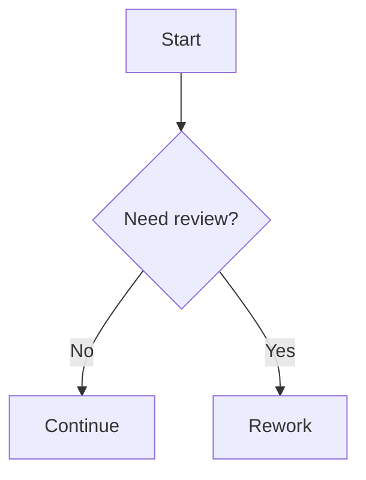

# Markdown examples

This page is a reference for the Markdown features supported by this site pipeline.

## Standard Markdown

You can use headings, paragraphs, lists, blockquotes, tables, and fenced code blocks.

### List example

- First item
- Second item
- Third item

| [details]                                                                                 |
| ----------------------------------------------------------------------------------------- |
| View source (md)                                                                          |
| <pre><code class="language-md">- First item<br>- Second item<br>- Third item</code></pre> |

### Checkboxes example

- [ ] First
- [x] Second
- or
- [ ] Third

| [details]                                                                              |
| -------------------------------------------------------------------------------------- |
| View source (md)                                                                       |
| <pre><code class="language-md">- [ ] First<br>- [x] Second<br>- [ ] Third</code></pre> |

### Blockquote example

> This is a standard Markdown blockquote.

| [details]                                                                              |
| -------------------------------------------------------------------------------------- |
| View source (md)                                                                       |
| <pre><code class="language-md">\> This is a standard Markdown blockquote.</code></pre> |

### Code block example

```bash
npm run build
```

| [details]                                                                         |
| --------------------------------------------------------------------------------- |
| View source (md)                                                                  |
| <pre><code class="language-md">\`\`\`bash<br>npm run build<br>\`\`\`</code></pre> |

## Internal links

Internal page links should be relative, omit the .md extension, and end with a trailing slash.

- [Home](#)
- [Processes index](#)
- [Process P-001](#)

| [details]                                                                                                                                                   |
| ----------------------------------------------------------------------------------------------------------------------------------------------------------- |
| View source (md)                                                                                                                                            |
| <pre><code class="language-md">- \[Home](./)<br>- \[Processes index](./processes/)<br>- \[Process P-001](./processes/p-001-scan-code-for-pii/)</code></pre> |

## GOV.UK button links

Prefix link text with button! to render a GOV.UK button.

[button!Start now](#)

| [details]                                                                    |
| ---------------------------------------------------------------------------- |
| View source (md)                                                             |
| <pre><code class="language-md">\[button!Start now](./some/page)</code></pre> |

## Details shorthand

Use a one-column table with [details] in the header and two body rows.

| [details]                        |
| -------------------------------- |
| How do I request sandbox access? |
| Follow [Process P-010](#).       |

| [details]                                                                                                                                                            |
| -------------------------------------------------------------------------------------------------------------------------------------------------------------------- |
| View source (md)                                                                                                                                                     |
| <pre><code class="language-md">\| [details] \|<br>\| \-\-\- \|<br>\| How do I request sandbox access? \|<br>\| Follow [Process P-010](./some/page). \| </code></pre> |

## Tables and row headers

Markdown tables are supported and styled. The first body-column cell is transformed into a row header for accessibility.

| Capability | Support |
| ---------- | ------- |
| Headings   | Yes     |
| Lists      | Yes     |
| Mermaid    | Yes     |

| [details]                                                                                                                                                                     |
| ----------------------------------------------------------------------------------------------------------------------------------------------------------------------------- |
| View source (md)                                                                                                                                                              |
| <pre><code class="language-md">\| Capability \| Support \|<br>\| ---------- \| ------- \|<br>\| Headings \| Yes \|<br>\| Lists \| Yes \|<br>\| Mermaid \| Yes \|</code></pre> |

## Mermaid diagrams

Use Mermaid for process and decision flows.



| [details]                                                                                                                                                                                                                                                                       |
| ------------------------------------------------------------------------------------------------------------------------------------------------------------------------------------------------------------------------------------------------------------------------------- |
| View source (md)                                                                                                                                                                                                                                                                |
| <pre><code class="language-md">\`\`\`mermaid<br>flowchart TD<br> Start["Start"]<br> Check{"Need review?"}<br> Continue["Continue"]<br> Rework["Rework"]<br><br> Start \-\-\>; Check<br> Check \-\- No \-\-\>; Continue<br> Check \-\- Yes \-\-\>; Rework<br>\`\`\`</code></pre> |

## ASCII fences

ASCII code fences are supported and rendered as inset text.

```ascii
+--------------------+
| Example plain text |
+--------------------+
```

| [details]                                                                                                                                         |
| ------------------------------------------------------------------------------------------------------------------------------------------------- |
| View source (md)                                                                                                                                  |
| <pre><code class="language-md">\`\`\`ascii<br>+--------------------+<br>\| Example plain text \|<br>+--------------------+<br>\`\`\`</code></pre> |

## Embedded HTML

If you use raw HTML, add GOV.UK classes manually.

<a class="govuk-link" href="#">Standards section</a>

| [details]                                                                                                             |
| --------------------------------------------------------------------------------------------------------------------- |
| View source (md)                                                                                                      |
| <pre><code class="language-md">\<a class=\"govuk-link\" href=\"./standards/\"\>;Standards section\</a\>;</code></pre> |
