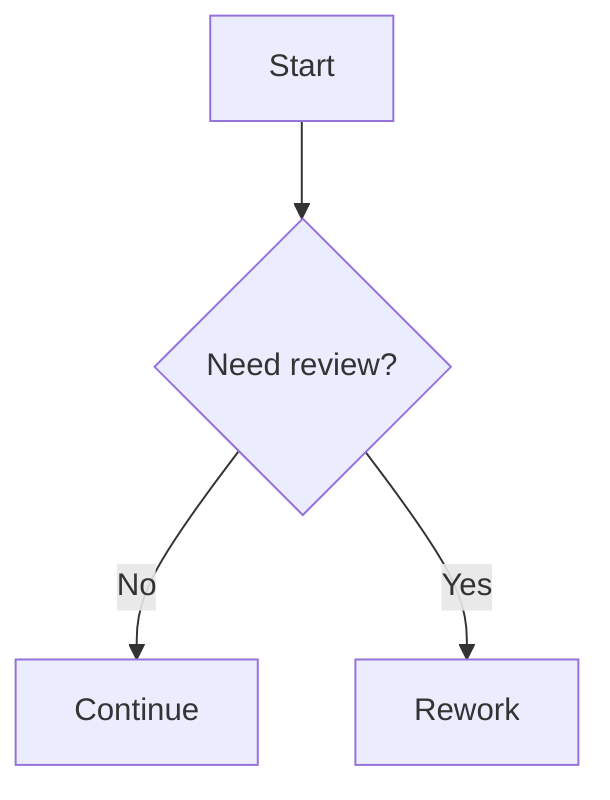

# Markdown examples

This page is a reference for the Markdown features supported by this site pipeline.

## Standard Markdown

You can use headings, paragraphs, lists, blockquotes, tables, and fenced code blocks.

### List example

- First item
- Second item
- Third item

<details>
<summary>View source (md)</summary>

```md
- First item
- Second item
- Third item
```

</details>

### Checkboxes example

- [ ] First
- [x] Second
- or
- [ ] Third

<details>
<summary>View source (md)</summary>

```md
- [ ] First
- [x] Second
- or
- [ ] Third
```

</details>

### Blockquote example

> This is a standard Markdown blockquote.

<details>
<summary>View source (md)</summary>

```md
> This is a standard Markdown blockquote.
```

</details>

### Code block example

```bash
npm run build
```

<details>
<summary>View source (md)</summary>

````md
```bash
npm run build
```
````

</details>

## Internal links

Internal page links should be relative, omit the .md extension, and end with a trailing slash. Use `~/` to link from the site root when that is clearer than repeated parent segments.

- [Home](#)
- [Processes index](#)
- [Process P-001](#)
- [AI catalogue](~/ai-catalogue/)

<details>
<summary>View source (md)</summary>

```md
- [Home](./)
- [Processes index](./processes/)
- [Process P-001](./processes/p-001-scan-code-for-pii/)
- [AI catalogue](~/ai-catalogue/)
```

</details>

## GOV.UK button links

Prefix link text with button! to render a GOV.UK button.

[button!Start now](#)

<details>
<summary>View source (md)</summary>

```md
[button!Start now](./some/page)
```

</details>

## Details blocks

Use `<details>` and `<summary>` HTML tags. The Markdown pipeline automatically adds GOV.UK classes.

Add a heading inside the summary to render its text as a linked heading without the standard GOV.UK heading class.

<details>
<summary><h3>How do I request sandbox access?</h3></summary>

Follow [Process P-010](#).

</details>

<details>
<summary>View source (md)</summary>

```md
<details>
<summary><h3>How do I request sandbox access?</h3></summary>

Follow [Process P-010](./some/page).

</details>
```

</details>

## Tables and row headers

Markdown tables are supported and styled. The first body-column cell is transformed into a row header for accessibility.

| Capability | Support |
| ---------- | ------- |
| Headings   | Yes     |
| Lists      | Yes     |
| Mermaid    | Yes     |

<details>
<summary>View source (md)</summary>

```md
| Capability | Support |
| ---------- | ------- |
| Headings   | Yes     |
| Lists      | Yes     |
| Mermaid    | Yes     |
```

</details>

## Mermaid diagrams

Use Mermaid for process and decision flows.



<details>
<summary>View source (md)</summary>

````md

````

</details>

## ASCII fences

ASCII code fences are supported and rendered as inset text.

```ascii
+--------------------+
| Example plain text |
+--------------------+
```

<details>
<summary>View source (md)</summary>

````md
```ascii
+--------------------+
| Example plain text |
+--------------------+
```
````

</details>

## Embedded HTML

If you use raw HTML, add GOV.UK classes manually.

<a class="govuk-link" href="#">Standards section</a>

<details>
<summary>View source (md)</summary>

```md
<a class="govuk-link" href="./standards/">Standards section</a>
```

</details>
