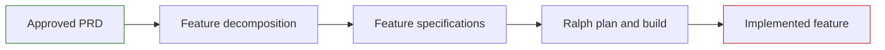

# Tooling

Re-Engineering combines feature decomposition with Ralph for iterative autonomous implementation. Both activities must operate within the project's approved information-governance and security controls.

## Toolchain



## Feature decomposition

Feature decomposition turns the approved PRD into independently deliverable feature specifications. Use the [Process](../process/) guidance to review the proposed feature plan, confirm dependencies and priorities, and obtain approval before implementation begins.

## Ralph autonomous build loop

[Ralph](https://github.com/marc0der/ralph) runs an AI coding agent through repeated planning and implementation iterations. Fresh agent sessions use shared project artefacts to continue work without relying on a single, long-lived context.

### Prerequisites

Before use, ensure that the following are installed and approved for the project:

- Docker with the capability to run the devcontainer sandbox
- the devcontainer command-line tool
- Ralph
- an authenticated supported AI backend

Confirm current installation steps and supported backends in the [Ralph documentation](https://github.com/marc0der/ralph). Tool versions, model availability and organisational approval requirements can change.

### Key commands

| Command | Purpose |
| --- | --- |
| `ralph sandbox` | Enter the devcontainer sandbox before autonomous work |
| `ralph init` | Initialise the shared workspace artefacts |
| `ralph plan` | Create or update the implementation plan from the specification and codebase |
| `ralph build` | Implement, test, commit and push plan items one at a time |
| `ralph archive` | Archive loop artefacts before starting the next feature |

Always start autonomous work with `ralph sandbox`. Ralph can use non-interactive tool permissions; the devcontainer is the isolation boundary that prevents an unattended agent from operating directly on the host machine.

Before starting a build loop, review the proposed scope. When an explicit iteration count is supplied, it can override the tool's normal confirmation and stall safeguards. Use fixed unattended iteration budgets only where this is deliberate, understood and appropriately governed.

### Project artefacts

| Artefact | Purpose |
| --- | --- |
| `AGENTS.md` or `CLAUDE.md` | Operational instructions, commands, conventions and guardrails maintained by the team |
| `IMPLEMENTATION_PLAN.md` | Prioritised work shared between agent iterations |
| `PROGRESS.md` | Append-only log of activity, learning, failures and unresolved work |
| `specs/` | Approved feature specifications that drive the current build |
| `rules/` | Detailed project standards used by the agent when making implementation decisions |

## Working across the two projects

Re-Engineering normally uses a source project containing the PRD and feature specifications, and a separate target application project where the replacement is built.

```text
re-engineering-project/
	output/
		PRD.md
		features/
			FT-001-feature-name.md

target-application-project/
	AGENTS.md
	rules/
	specs/
		FT-001-feature-name.md
	IMPLEMENTATION_PLAN.md
	PROGRESS.md
	src/
	test/
```

Copy one approved feature specification into the target project's `specs/` directory at a time. Complete the plan, build and implementation-review cycle before progressing to the next feature.

## Source material

This page adapts the [Re-Engineering Tooling](https://defra.github.io/defra-ai-modernisation-playbook/pages/re-engineering/tooling/) and [Ralph](https://defra.github.io/defra-ai-modernisation-playbook/pages/re-engineering/tooling/ralph/) guidance from the AI-Enabled Legacy Modernisation Playbook.