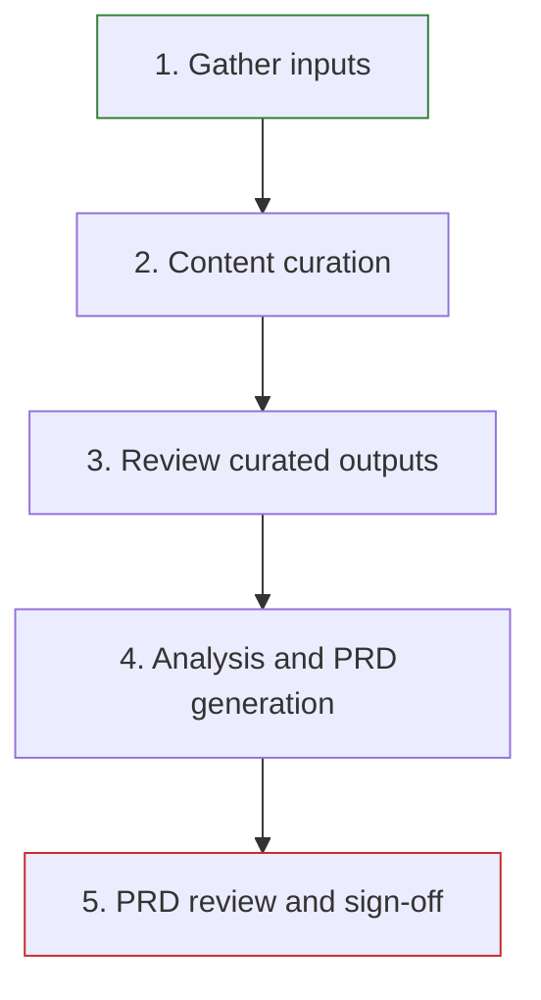
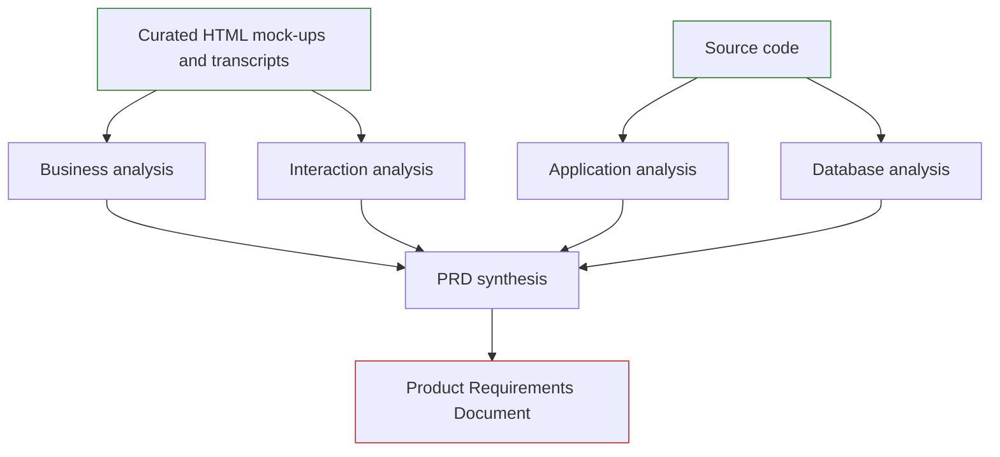

# Process

The reverse engineering process turns legacy application artefacts into a Product Requirements Document (PRD). It has five phases, with an internal quality gate before automated analysis and a stakeholder approval gate at the end.

## Before you start

Collect all three mandatory input types. Omitting an input type will reduce the completeness of the resulting analysis and PRD.

| Input                             | Suggested location | Contribution                                                                 |
| --------------------------------- | ------------------ | ---------------------------------------------------------------------------- |
| Source code                       | `src/`             | Application behaviour, business rules and data model                         |
| User interface screenshots        | `screenshots/`     | Visible screens, layouts and user workflows                                  |
| Stakeholder interview transcripts | `transcripts/`     | Domain knowledge, business context and user perspectives not evident in code |

Transcripts must be free of personally identifiable information before they are processed.

## The five phases

### 1. Gather inputs

Gather complete, relevant source material before analysis begins.

| Input                 | Requirements                                                                                                                                                         | Good practice                                                                                                                                                 |
| --------------------- | -------------------------------------------------------------------------------------------------------------------------------------------------------------------- | ------------------------------------------------------------------------------------------------------------------------------------------------------------- |
| Screenshots           | Capture all screens and important states, including errors, confirmation dialogs and administrative views. Common image formats include PNG, JPG, GIF, BMP and WebP. | Capture populated and empty states, and views for each user role where applicable. Work through the application systematically rather than relying on memory. |
| Source code           | Include the complete solution, including database projects, SQL scripts and configuration files.                                                                     | Consolidate code from multiple repositories under `src/` where possible. Partial source code can lead to incomplete analysis.                                 |
| Interview transcripts | Use plain-text transcripts from recorded interviews, with PII removed before processing.                                                                             | Ask users to demonstrate and narrate real workflows. Separate recordings by topic or user role when this improves clarity.                                    |

### 2. Content curation

Content curation prepares the non-code inputs for analysis:

- screenshot-to-HTML conversion creates semantic, unstyled HTML mock-ups that record visible user interface elements and text; any visible PII is replaced with fictional equivalents
- transcript curation removes off-topic discussion, such as scheduling or social conversation, while keeping domain knowledge, application walkthroughs and technical detail

The expected outputs are semantic HTML mock-ups in `output/html/` and curated transcripts in `output/transcripts/`.

Run the approved curation tooling against all collected screenshots and transcripts. For a large set of files, monitor progress and divide or resume the work if the tool does not finish the full set in one run.

### 3. Review curated outputs

This is the internal quality gate before automated analysis. The BA/UR should lead the review because they hold the interview and domain context.

For each HTML mock-up, check:

- it faithfully represents the screenshot
- all visible text is correctly captured
- visible PII has been replaced with suitable fictional content
- forms, tables, navigation and layout are represented correctly
- every screenshot has a corresponding mock-up

For each curated transcript, check:

- domain knowledge and walkthrough content have been preserved
- off-topic content has been removed
- no PII remains
- important context has not been accidentally removed

If an output fails review, rerun the relevant curation step against the original input and repeat the check. Do not begin analysis until the curated material is accurate and complete.

### 4. Analysis and PRD generation

Specialist analysis roles examine the curated content and source code. The content and code analysis can run in parallel, while PRD synthesis waits for all analysis outputs.

| Analyst               | Focus                                                                                                     | Output                           |
| --------------------- | --------------------------------------------------------------------------------------------------------- | -------------------------------- |
| Business analyst      | Domain language, bounded contexts, subdomains and context maps from curated transcripts and HTML mock-ups | `output/domain-analysis.md`      |
| Interaction analyst   | Screen inventory, user workflows and navigation from HTML mock-ups and curated transcripts                | `output/interaction-analysis.md` |
| Application developer | Application workflows, behaviour, domain model, business rules and integration points from source code    | `output/application-analysis.md` |
| Database analyst      | Schema, stored procedures, triggers, constraints and database business rules from SQL and database code   | `output/database-analysis.md`    |

The synthesis stage cross-references all four analysis outputs and produces a PRD covering application behaviour, the domain model, workflows and business rules.

### 5. PRD review and sign-off

The delivery team reviews the PRD for completeness and accuracy before the Application Product Owner approves it. Publish the document in the agreed controlled location so stakeholders can access it for review.

Check the PRD against the source material and interview evidence:

- **Completeness**: features, workflows and business rules are included.
- **Accuracy**: the PRD agrees with what stakeholders described and what the code reveals.
- **Traceability**: every factual claim is supported by source code, screenshots or transcripts. Investigate unsupported claims rather than treating them as facts.
- **Open questions**: gaps are recorded and resolved through further evidence or stakeholder discussion where possible.
- **Domain language**: terms, bounded contexts and concepts reflect stakeholder understanding rather than only code-level naming.

The phase ends when the Application Product Owner confirms that the PRD accurately represents the application and signs it off. The approved PRD is then ready for implementation planning.
