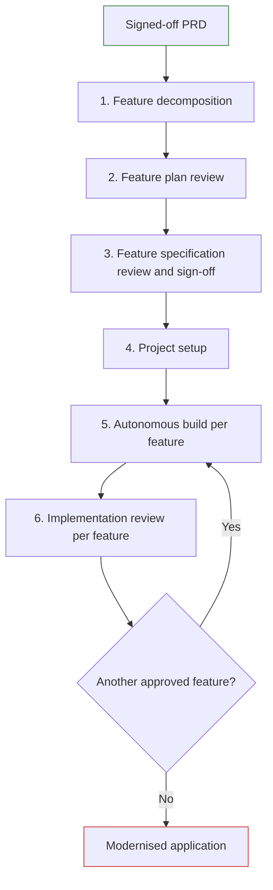

# Process

The Re-Engineering process takes an approved PRD and turns it into reviewed, implemented features for a modern replacement application. It begins by creating feature specifications and then repeats an autonomous build and review cycle for each approved feature.

## Input and outputs

| Type                | Location                      | Purpose                                                                   |
| ------------------- | ----------------------------- | ------------------------------------------------------------------------- |
| Input               | `output/PRD.md`               | The approved requirements for the legacy application                      |
| Intermediate output | `output/features/FT-*.md`     | One feature specification for each independently deliverable unit of work |
| Delivery output     | Target application repository | Implemented, tested and reviewed features                                 |

## The six phases

### 1. Feature decomposition

Use the `prd-to-features` agent to analyse the signed-off PRD and propose a breakdown into feature specifications. The agent first presents a feature plan for review, then generates individual specification files after the plan is confirmed.

Each feature should:

- be self-contained and independently deliverable
- represent a coherent unit of user value rather than a technical layer
- preferably remain within one bounded context
- make shared infrastructure, such as authentication, navigation or reference data, explicit where it needs its own feature

Order features from the bottom up:

| Build layer | Typical content                                                                |
| ----------- | ------------------------------------------------------------------------------ |
| Lowest      | Shared reference data, core entities and data models                           |
| Middle      | Domain screens, workflows and business capabilities                            |
| Highest     | Authentication, authorisation, navigation shells, landing pages and dashboards |

The feature plan records identifiers, titles, priorities, build layers and dependencies. A feature's build layer is one greater than the highest layer of its upstream dependencies, or zero when it has none. Confirm the plan before feature specifications are generated.

### 2. Feature plan review

The product manager and stakeholders should review the plan before the agent creates specifications. Check:

- feature IDs are sequential, titles are clear and each description is appropriately scoped
- MoSCoW priorities reflect business criticality
- PRD sections are mapped to the appropriate features
- foundation features appear in lower layers and navigation or dashboard features in higher layers
- each feature represents a coherent, independently deliverable unit of user value
- all upstream dependencies are in lower layers, no circular dependencies exist, and shared dependencies are explicit
- all bounded contexts, screens, workflows, business rules and common infrastructure are covered

Describe any required adjustments to the agent and obtain a revised plan before confirmation.

### 3. Feature specification review and sign-off

Review each file in `output/features/` individually. Different team members can review different files, but the set must also be checked collectively for coverage.

For each feature, confirm:

- user stories cover happy, alternative and error paths
- in-scope, out-of-scope and boundary statements match the confirmed feature plan
- business rules, data entities and dependencies agree with the PRD and plan
- acceptance criteria are specific and testable
- wireframes agree with the PRD's screen descriptions and field lists
- every claim is traceable to the PRD, with no invented rules or requirements
- open questions are resolved, accepted or escalated before they block development

The product manager, business analyst and relevant stakeholders approve the feature specifications. The outcome is a set of independently buildable, signed-off features.

### 4. Project setup

Prepare the target project before autonomous build begins. The AI agent needs clear operational instructions and project-specific rules.

Set up:

- approved AI tooling, including Copilot Ralph and authenticated GitHub Copilot access
- an `AGENTS.md` file that explains project purpose, commands, ports and environment, Git workflow, and non-obvious gotchas
- a `rules/` directory containing focused guidance for architecture, languages, frameworks, testing, infrastructure and design systems relevant to the project

Keep the agent instruction file concise. Include information the agent cannot infer from the codebase; place detailed standards in the `rules/` files. Validate installation, build, test, lint and type-check commands before the autonomous loop is allowed to use them.

### 5. Autonomous build

Use an approved autonomous loop runner, such as Copilot Ralph, to implement one signed-off feature at a time:

1. Copy the next approved feature specification into the target project's `specs/` directory.
2. Start the loop with the feature specification as the prompt. Each iteration builds on the previous one, implementing the specification, running checks and committing the result.
3. Set a deliberate maximum iteration count and timeout so the loop cannot run unattended beyond an agreed budget.
4. Review the implementation before continuing to the next feature.

If an iteration is interrupted, re-run the loop against the current state of the codebase rather than recreating project state. Each iteration commits its work, so the Git history is the record of what was done.

### 6. Implementation review

After each build loop, the product manager and a software engineer review the feature before integration and before work begins on the next feature. The [Completeness Auditor](https://defra.github.io/defra-ai-config-examples/pages/agents/lap-gitHub-copilot/lap-innovation-completeness-auditor.agent) agent reconciles the build against the feature traceability manifest so that no functionality is lost.

Review:

- whether the implementation matches the approved feature specification
- whether tests are meaningful and cover acceptance criteria
- code quality, project conventions, dead code, placeholders and incomplete work
- workflow behaviour, usability and unanticipated edge cases
- the iteration history and commit log for recurring failures, unresolved work, useful learning and commands that did not run as expected

If issues are found, improve the implementation or update the relevant specification before continuing. When the feature is accepted, move to the next feature in build-layer order.
