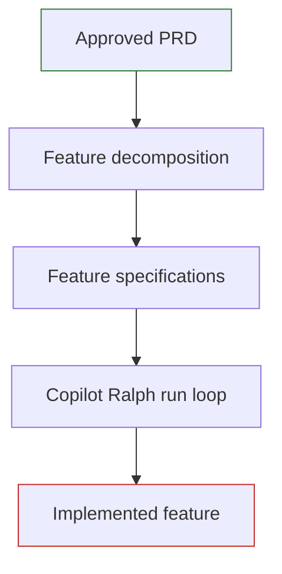

# Tooling

Modern rebuild combines feature decomposition with Copilot Ralph for iterative autonomous implementation. Both activities must operate within the project's approved information-governance and security controls.

## Toolchain



## Feature decomposition

The [PRD to Features](https://defra.github.io/defra-ai-config-examples/pages/agents/lap-gitHub-copilot/lap-innovation-prd-to-features.agent) agent turns the approved PRD into independently deliverable feature specifications, verifying full coverage and emitting a traceability manifest, with individual specifications written by the [Feature Writer](https://defra.github.io/defra-ai-config-examples/pages/agents/lap-gitHub-copilot/lap-innovation-feature-writer.agent) agent. Use the [Process](../process/) guidance to review the proposed feature plan, confirm dependencies and priorities, and obtain approval before implementation begins.

## Copilot Ralph autonomous build loop

[Copilot Ralph](https://github.com/JanDeDobbeleer/copilot-ralph) runs GitHub Copilot through repeated iterations, feeding a prompt to the agent so each pass builds on the previous one until the task is complete. It implements the "Ralph Wiggum" loop pattern using the GitHub Copilot SDK.

### Prerequisites

Before use, ensure that the following are installed and approved for the project:

- Go 1.24 or later
- Git
- authenticated GitHub Copilot access

Install the command line tool with Go:

```sh
go install github.com/JanDeDobbeleer/copilot-ralph/cmd/ralph@latest
```

Confirm current installation steps and supported models in the [Copilot Ralph documentation](https://github.com/JanDeDobbeleer/copilot-ralph). Tool versions, model availability and organisational approval requirements can change.

### Running the loop

Run the loop with a prompt, or with a Markdown file such as an approved feature specification:

```sh
ralph run "Implement the next feature specification in specs/"
ralph run specs/FT-001-feature-name.md
```

Common options:

| Option             | Purpose                                                     |
| ------------------ | ----------------------------------------------------------- |
| `--max-iterations` | Maximum loop iterations before stopping (default 10)        |
| `--timeout`        | Maximum runtime before stopping, for example `30m` or `1h`  |
| `--model`          | The AI model to use                                         |
| `--promise`        | The completion phrase that signals the task is done         |
| `--dry-run`        | Show the configuration and planned run without executing it |

The loop exits when the task reports completion, the maximum iterations are reached, the timeout is exceeded, an error occurs, or you cancel it. Set `--max-iterations` and `--timeout` deliberately: unattended iteration budgets must be understood and appropriately governed.

### Project artefacts

| Artefact    | Purpose                                                                               |
| ----------- | ------------------------------------------------------------------------------------- |
| `AGENTS.md` | Operational instructions, commands, conventions and guardrails maintained by the team |
| `specs/`    | Approved feature specifications that drive the current build                           |
| `rules/`    | Detailed project standards used by the agent when making implementation decisions      |

## Working across the two projects

Modern rebuild normally uses a source project containing the PRD and feature specifications, and a separate target application project where the replacement is built.

```ascii
modern-rebuild-project/
	output/
		PRD.md
		features/
			FT-001-feature-name.md

target-application-project/
	AGENTS.md
	rules/
	specs/
		FT-001-feature-name.md
	src/
	test/
```

Copy one approved feature specification into the target project's `specs/` directory at a time. Complete the build and implementation-review cycle before progressing to the next feature.
