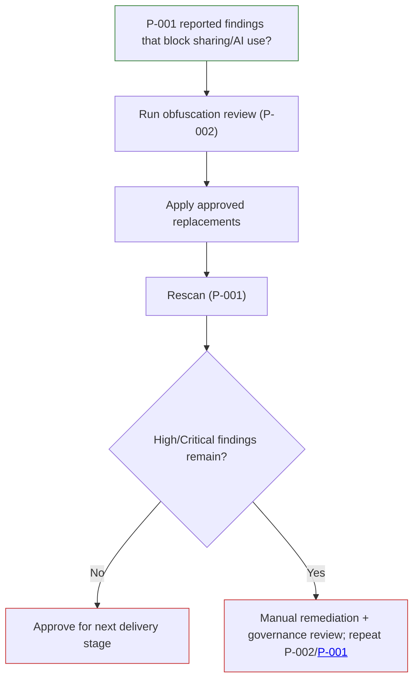

# P-003: How to Obfuscate PII and Revalidate

**Process ID:** P-003

**Title:** How to remove or obfuscate PII safely and confirm the code is clear

**What You're Trying To Do:**
Replace or remove sensitive values found in code while preserving working software, then verify that the updated code can be safely shared or used with AI tooling.

**Who This Is For:**
Engineers performing the updates, delivery leads accountable for release risk, and non-technical approvers who need evidence that sensitive data has been handled correctly.

**Step-by-Step:**

1. Start from a completed P-001 scan report with findings that require action.
2. Run the obfuscation workflow in review mode so each finding is explicitly approved, skipped, or marked for manual handling.
3. Use dry-run preview when needed to show what would change before writing to files.
4. Apply approved replacements so sensitive values are replaced by safe placeholders.
5. Keep the generated session and report files in a controlled location for audit and review.
6. If any replacement causes issues, use rollback to restore original files.
7. Rescan the same code scope using P-001.
8. Close the process only when high-risk findings are cleared or formally accepted through governance.

**Decision Tree / Flow Diagram:**

**Who To Contact:**
Engineering lead (implementation decisions), security approver (residual risk), and project manager (delivery impact and sign-off tracking).

**Governance / Approval Gate:**
Where personal data was detected, evidence of remediation and revalidation must be retained before code is used in AI-assisted workflows or shared externally.

**Related Blocker:**
Blocker 2 - PII in Source Code

**Related Agent/Tool Links:**

- [LAP PII Screener repository](https://github.com/DEFRA/lap-pii-screener)
- [Obfuscation process](https://github.com/DEFRA/lap-pii-screener/blob/main/docs/guides/obfuscation.md)
- [Scan command reference](https://github.com/DEFRA/lap-pii-screener/blob/main/docs/guides/scanning.md)
- [Report outputs for audit packs](https://github.com/DEFRA/lap-pii-screener/blob/main/docs/guides/reports.md)

**Status:**
Draft (ready for governance walkthrough and naming alignment with central Blueprint IDs)
