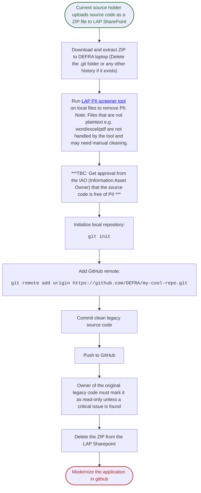

# P-003: How to Prepare Source Code for Modernisation

**Process ID:** P-003

**Title:** How to onboard legacy source code safely and prepare it for modernisation

**What You're Trying To Do:**
Make legacy source code available to a LAP project in a public space. Before this can be done, the legacy source code needs to be scanned and cleaned to remove any PII or sensitive information.

**Who This Is For:**
Source system owners, delivery leads, engineers, and governance approvers responsible for preparing source code before modernisation and AI-assisted workflows begin.

**Prerequisites**

- The current application source code owner has been identified and located.
- Access to the LAP SharePoint is available.
- A repository has been created in DEFRA GitHub.
  - Details on how to do this are here: https://defra.github.io/software-development-standards/processes/github_access/
- You have a DEFRA laptop capable of running the PII screener.

**Step-by-step**

**Who To Contact:**
Delivery lead (process coordination), Information Asset Owner (PII approval), and engineering lead (repository setup and commit flow).

**Governance / Approval Gate:**
Code must not be used for AI-assisted workflows or broader sharing until PII screening has completed and IAO approval has been recorded.

**Related Blocker:** -

**Related Agent/Tool Links:**

- [LAP PII Screener repository](https://github.com/DEFRA/lap-pii-screener)

**Status:**
Draft (pending governance wording confirmation)
